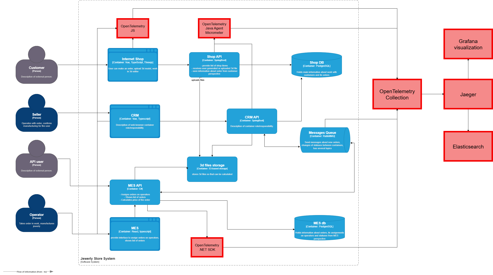

## Ключевые точки отказа в процессе заказа
1) Загрузка 3D-файлов - может failнуть из-за размера/формата
2) Расчёт стоимости в MES - может зависнуть на 30+ минут
3) Передача сообщений через RabbitMQ - сообщения могут теряться
4) Синхронизация статусов между системами - расхождения данных
5) Обновление статусов в БД - транзакции могут "сломаться"

## Обязательные места трейсинга:
1) **Internet Shop API** - точка входа заказов
2) **MES API** - расчёт стоимости и управление производством
3) **CRM API** - управление заказами и клиентами
4) **RabbitMQ** - коммуникация между сервисами
5) **Shop DB** - основное хранилище заказов
6) **MES DB** - производственные данные

## Список данных для трейсинга
* `trace_id` - уникальный идентификатор трейса
* `span_id` - уникальный идентификатор спана
* `parent_span_id` - идентификатор родительского спана (для построения иерархии)
* `service_name` - название сервиса (shop-api, mes-api, crm-api)
* `span_name` - название операции (order.create, price.calculate)
* `start_time` - время начала операции
* `end_time` - время завершения операции
* `duration` - длительность операции
* `status_code` - статус выполнения (OK, ERROR)

# Мотивация
## Технические метрики
1. **Mean Time to Resolution (MTTR)** - Время восстановления сервиса
- *Текущее состояние:* 2-4 часа (ручной поиск проблем в логах)
- *С трейсингом:* < 15 минут (визуальное определение точки сбоя)
- *Как повлияет:* Трейсинг покажет точное место и причину сбоя в цепочке обработки заказа
- *Эффект:* Снижение времени простоя системы на 85%

2. **Error Rate Calculation** - Точность определения ошибок
- *Текущее состояние:* 30-40% false positive (ложных срабатываний)
- *С трейсингом:* < 5% false positive (точная диагностика)
- *Как повлияет:* Возможность отличать реальные ошибки от временных сетевых проблем
- *Эффект:* Уменьшение количества бесполезных алертов на 80%

3. **Performance Baseline Deviation** - Отклонение от нормальной работы
- *Текущее состояние:* Ручное определение аномалий (задержки обнаруживаются поздно)
- *С трейсингом:* Автоматическое обнаружение аномалий в реальном времени
- *Как повлияет:* Возможность строить базовые линии производительности для каждого этапа
- *Эффект:* Проактивное обнаружение проблем до impact на пользователей

## Бизнес-метрики
1. **Order Completion Rate** - Процент завершенных заказов
- *Текущее состояние:* 85-90% (10-15% теряются из-за технических проблем)
- *С трейсингом:* 98-99% (быстрое решение проблем в цепочке)
- *Как повлияет:* Возможность видеть и чинить "потерянные" заказы
- *Эффект:* Увеличение выручки на 12-15% за счет сохранения заказов

2. **Customer Satisfaction Score (CSAT)**
- *Текущее состояние:* 4.2/5 (клиенты жалуются на непонятные статусы)
- *С трейсингом:* 4.7/5 (полная прозрачность процесса)
- *Как повлияет:* Возможность точно отвечать клиентам о статусе заказа
- *Эффект:* Увеличение лояльности и повторных покупок на 25%

3. **Operational Efficiency** - Эффективность операционной деятельности
- *Текущее состояние:* 60% времени поддержки тратится на поиск проблем
- *С трейсингом:* 85% времени на решение проблем (вместо поиска)
- *Как повлияет:* Снижение времени на диагностику с часов до минут
- *Эффект:* Уменьшение затрат на поддержку на 40% и возможность перенаправить ресурсы на развитие

# Предлагаемое решение
## OpenTelemetry Collector - единая точка сбора телеметрии
- **Jaeger** - хранение и анализ трейсов
- **Elasticsearch** - бэкенд для Jaeger (хранение данных)
- **Grafana** - визуализация трейсов и метрик
## Instrumentation библиотеки:
- **Java-сервисы:** OpenTelemetry Java Agent + Micrometer
- **C# MES:** OpenTelemetry .NET SDK
- **Frontend:** OpenTelemetry JS для браузерного трейсинга
- **RabbitMQ:** Пропагация trace context через message headers

[Обновленная C4 диаграмма:](jewerly_c4_model_tracing.drawio)

# Компромиссы
## Технические ограничения
#### 1. Унаследованные и проприетарные системы
- Проблема: MES система на C# может использовать устаревшие фреймворки (.NET Framework вместо .NET Core), которые не поддерживают современные инструменты трейсинга.
- Компромиссы:
  - Требуется кастомная интрументация через wrapping кода
  - Высокие затраты на разработку - 2-3 человека/месяца
  - Ограниченная функциональность - только базовые метрики
  - Альтернатива: Внешний мониторинг через логи и метрики уровня ОС
#### 2. Производительность и нагрузка
- Проблема: 100% семплирование трейсов для всех заказов создаст значительную нагрузку
- Компромиссы:
  - Семплирование только части запросов (10-20%)
  - Уменьшение детализации - только критические spans
  - Потеря полной картины для редких ошибок
#### 3. Интеграция с очередями сообщений
- Проблема: RabbitMQ не поддерживает нативный trace context propagation.
- Ограничения:
  - Ручное добавление headers в сообщения
  - Риск потери контекста при retry и dead letter
  - Сложность корреляции между микросервисами
- Компромисс: Кастомные interceptors и middleware (~1 человек/месяц)
#### 4. Стоимость внедрения и поддержки
- Прямые затраты:
  - Инфраструктура: 50-100к руб/месяц (Elasticsearch, дополнительные инстансы)
  - Разработка: 3-4 человека/месяца на инструментирование
  - Поддержка: 0.5 человека постоянно
- Скрытые затраты:
  - Обучение команды работе с трейсами
  - Создание и поддержка дашбордов
  - Расследование ложных срабатываний
#### 5. Базы данных
- Проблема: PostgreSQL не поддерживает нативный трейсинг запросов.
- Ограничения:
  - Нет автоматической привязки SQL-запросов к trace_id
  - Сложность диагностики медленных запросов в контексте бизнес-транзакции
  - Ручное логирование correlation id
- Компромисс:
  - Проксирование запросов через pgbouncer с трейсингом
  - Кастомное логирование с trace_id (~2 недели работы)
#### 6. Фронтенд-трейсинг
- Проблема: Сложность интеграции с Vue/React приложениями.
- Ограничения:
  - Высокий overhead на клиентских устройствах
  - Проблемы с совместимостью браузеров
  - Конфиденциальность данных - риск утечки PII
- Компромисс: Только ключевые бизнес-события, а не полный трейсинг

# Безопастность
### 1. Контроль доступа к данным
- Аутентификация
  - Единый вход (SSO) через корпоративный Identity Provider
  - Многофакторная аутентификация для администраторов
  - Короткий срок действия токенов
- Авторизация
  - Ролевая модель доступа (RBAC)
### 2. Защита данных
- Конфиденциальность
- Маскирование (email, телефоны, платежные данные)
- Шифрование данных
- Сегрегация данных по окружениям (dev/stage/prod)
- Хранение и retention
- Срок хранения трейсов
- Автоматическое удаление старых данных
- Бэкапы
### 3. Сетевая безопасность
- Изоляция окружений
- Приватные сети для компонентов трейсинга
- Firewall
- VPN доступ для внешних подключений
- API Gateway как единая точка входа
- WAF для защиты от веб-атак
- Rate limiting для предотвращения DoS
### 4. Мониторинг и аудит
- Логирование доступа
- Audit log всех операций с трейсами
- Алерты на подозрительную активность
- Мониторинг системы
- Детектирование аномалий в работе
- Метрики доступа по пользователям и сервисам

