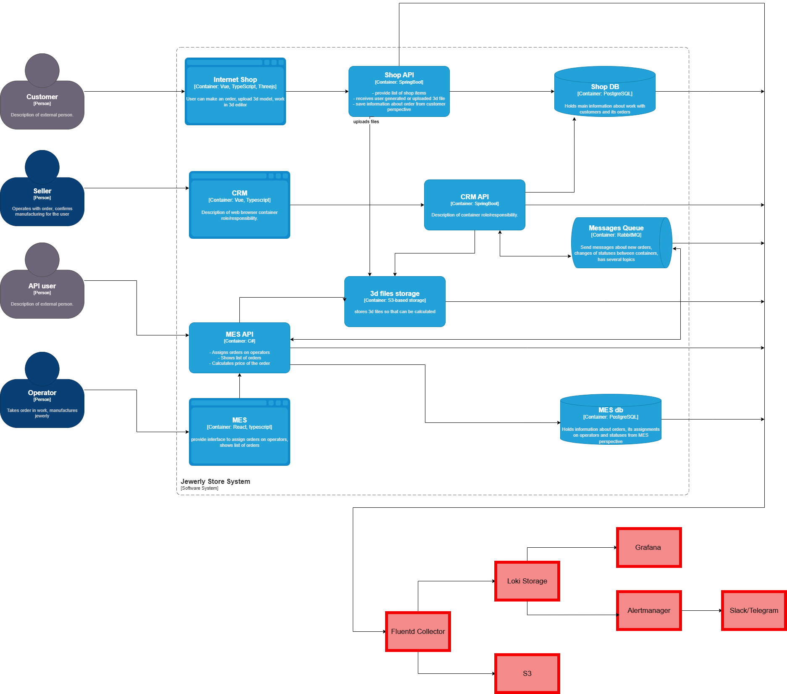

# Список необходимых логов с уровнем INFO
### Критически важные:
* Internet Shop API - заказы и платежи
* CRM API - работа с клиентами
* MES API - расчет стоимости и производство
* RabbitMQ - сообщения между сервисами
* Shop DB - логи запросов БД
* MES DB - логи производственных данных

### Уровни логирования и их использование
* **INFO** (Основной уровень)
    * Изменение статусов заказов
    * Создание/обновление сущностей
    * Успешные операции с файлами
    * Расчет стоимости и ценообразование
    * Интеграционные вызовы между сервисами
* **DEBUG** (Детальная отладка)
    * Параметры запросов и ответов
    * Промежуточные состояния вычислений
    * Внутренняя бизнес-логика
    * Отладка сложных сценариев
    * Использование: Только в dev/stage окружениях или по требованию для конкретного сеанса
* **WARN** (Предупреждения)
    * Медленные операции (>5 секунд)
    * Частичные failures (retry logic)
    * Нестандартные ситуации, требующие внимания
    * Deprecation warnings
* **ERROR** (Ошибки)
    * Неудачные операции с заказами
    * Ошибки интеграции между сервисами
    * Проблемы с внешними API
    * Validation errors
* **FATAL** (Критические ошибки)
    * Невозможность работы сервиса
    * Потеря связи с критическими компонентами
    * Базовая функциональность недоступна

# Мотивация
### Логирование решит:
* Мгновенный доступ ко всей истории работы системы
* Полная видимость сквозных бизнес-процессов
* Сокращение времени диагностики с часов до минут
* Проактивное обнаружение проблем до жалоб клиентов

### Преимущества внедрения логирования
| Технические преимущества                   | Бизнес-преимущества                                   |
|--------------------------------------------|-------------------------------------------------------|
| Единая точка для расследования инцидентов  | Снижение нагрузки на поддержку на 40-50%              |
| Корреляция событий между разными системами | Улучшение клиентского опыта - быстрее решаем проблемы |
| Автоматическое оповещение о проблемах      | Data-driven решения по развитию системы               |
| Исторический анализ для поиска паттернов   | Снижение рисков бизнес-процессов                      |

### Ключевые метрики, на которые повлияет логирование
| Ключевые метрики               | Текущее состояние                   | Цель с логированием   | Влияние                                   |
|--------------------------------|-------------------------------------|-----------------------|-------------------------------------------|
| Mean Time To Resolution (MTTR) | 2-4 часа на диагностику проблем     | < 30 минут            | Снижение операционных затрат на поддержку |
| First Contact Resolution Rate  | 20-30% решений при первом обращении | 60-70%                | Увеличение удовлетворенности клиентов     |
| Customer Incident Volume       | 10-15 инцидентов/день               | 3-5 инцидентов/день   | Снижение нагрузки на поддержку            |
| System Availability            | 95-98% (измеряется приблизительно)  | 99.9% измеряемого SLA | Повышение надежности сервиса              |

### Приоритизация внедрения (поэтапный подход)
#### Phase 1: Критически важные системы (2-3 недели)
1. **Shop API** - высший приоритет
* **Причина:** Центральный сервис заказов, точка входа клиентов
* **Цель логирование:** Создание заказов, платежи, изменения статусов
* **Влияние на бизнес** 70% инцидентов связаны с заказами
2. **RabbitMQ** - высокий приоритет
* **Причина:** Кровеносная система интеграций
* **Цель логирование:** Сообщения, обработка, ошибки доставки
* **Влияние на бизнес:** Проблемы здесь блокируют все процессы
#### Phase 2: Важные системы (3-4 недели)
3. **MES API** - высокий приоритет
* **Причина:** Расчет стоимости - ключевая бизнес-логика
* **Цель логирование:** Время расчетов, ошибки, параметры моделей
* **Влияние на бизнес:** Влияет на конверсию в покупки
4. CRM API - средний приоритет
* **Причина:** Работа продавцов и управление заказами
* **Цель логирование:** Изменения статусов, действия операторов
* **Влияние на бизнес:** Влияет на эффективность производства
#### Phase 3: Второстепенные системы (4-6 недель)
5. **Базы данных** - средний приоритет
* **Причина:** Хранилище всех критических данных
* **Цель логирование:** Медленные запросы, ошибки, блокировки
* **Влияние на бизнес:** Влияет на производительность системы
6. **Frontend приложения** - низкий приоритет
* **Причина**: Клиентская часть, меньше бизнес-логики
* **Цель логирование:** Ошибки интерфейса, действия пользователей
* **Влияние на бизнес:** Улучшение UX, но не критично для работы

### Причины приоритизациии логирования
* Логирование дает немедленную ценность:
    * Проще внедрить - меньше изменений в коде
    * Быстрее окупаемость - решает основные боли сразу
    * Меньше overhead - не влияет на производительность
    * Основа для трейсинга - логи помогают настроить правильный трейсинг
* Трейсинг требует:
    * Больше ресурсов на внедрение и поддержку
    * Высокую культуру работы с распределенными системами
    * Сложную инфраструктуру для хранения и анализа
    * Время для обучения команды

# Предлагаемое решение

[Схема логирования](jewerly_c4_model_logging.drawio)

### Технологический стек
* **Сбор логов:** Fluentd (агенты на всех серверах)
* **Хранение:** Loki (оптимизирован для логов)
* **Визуализация:** Grafana (единый интерфейс)
* **Оповещения:** Alertmanager + Slack/Telegram

### Что логировать в первую очередь
* **Shop API** - заказы и платежи
* **RabbitMQ** - сообщения между сервисами
* **MES API** - расчет стоимости
* **Базы данных** - медленные запросы
### Безопасность
* Маскирование PII в логах
* TLS шифрование при передаче
* RBAC доступ через Grafana
* Аудит всех операций
### Хранение
* 7 дней - горячее хранение (Loki)
* 30 дней - холодное хранение (S3)
* 1 год - архив для аудита

### Обработка чувствительных данных
| Тип данных          | Метод обработки     | Пример                                         |
|---------------------|---------------------|------------------------------------------------|
| Персональные данные | Маскирование        | email@domain.com → ***@domain.com              |
| Платежные данные    | Полное маскирование | 4111 1111 1111 1111 → **** **** **** 1111      |
| Пароли/токены       | Полное маскирование | password123 → ********                         |
| 3D-модели           | Метаданные только   | Хранение только путей к файлам, не содержимого |

### Доступ к логам
| Роль       | Доступ к логам                          | Операции                             | Пример пользователей  |
|------------|-----------------------------------------|--------------------------------------|-----------------------|
| Developer  | Только свои сервисы + dev окружения     | Read-only, поиск, фильтрация         | Разработчики Java/C#  |
| Support    | Все production логи	Read-only, создание | saved queries                        | Специалисты поддержки |       
| SRE/DevOps | Все логи всех окружений                 | Read-only, настройка алертов         | DevOps инженеры       |      
| Security   | Все логи + audit logs                   | Read-only, экспорт для расследований | Security team         |     
| Admin      | Полный доступ ко всем системам          | Read/Write, управление retention     | Тимлид, архитектор    |     

### Структура индексов
| Тип логов              | Индекс                 | Срок хранения | Пример размера |
|------------------------|------------------------|---------------|----------------|
| Application (Shop API) | logs-shop-api-%Y.%m.%d | 7 дней        | 10 GB/день     |
| Application (CRM API)  | logs-crm-api-%Y.%m.%d  | 7 дней        | 5 GB/день      |
| Application (MES API)  | logs-mes-api-%Y.%m.%d  | 7 дней        | 15 GB/день     |
| Database queries       | logs-db-%Y.%m.%d       | 30 дней       | 8 GB/день      |
| RabbitMQ messages      | logs-mq-%Y.%m.%d       | 14 дней       | 5 GB/день      |
| Audit/security         | logs-audit-%Y.%m.%d    | 90 дней       | 2 GB/день      |
| Infrastructure         | logs-infra-%Y.%m.%d    | 30 дней       | 5 GB/день      |

### Уровни хранения
#### Hot Storage (Loki)
* Длительность: 7 дней
* Общий объем: ~350 GB
* Доступ: Быстрый поиск и аналитика
* Стоимость: ~5,000 руб/месяц
#### Cold Storage (S3)
* Длительность: 30 дней
* Общий объем: ~1.2 TB
* Доступ: Поиск с задержкой 2-5 сек
* Стоимость: ~2,000 руб/месяц
#### Archive Storage (S3 Glacier)
* Длительность: 1 год
* Общий объем: ~4 TB
* Доступ: Восстановление за 2-12 часов
* Стоимость: ~500 руб/месяц

### Алертинг на основе логов
| Тип алерта                 | Условие срабатывания                     | Критичность |
|----------------------------|------------------------------------------|-------------|
| Резкий рост ошибок         | > 5% error rate от общего числа запросов | High        |
| Аномальный рост заказов    | > 1000% увеличение за 5 минут            | High        |
| Медленные ответы API       | latency > 5s                             | Medium      |
| Зависшие расчеты стоимости | Расчет > 30 минут                        | High        |
| Потеря сообщений RabbitM   | Dead letters > 10 в минуту               | High        |
| Недоступность сервиса      | 5xx errors > 50%                         | Critical    |

### Поиск аномалий и угроз
| Тип аномалии         | Метод определения           |
|----------------------|-----------------------------|
| DDoS атака           | Аномальный рост             |
| Брутфорс атака       | Множественные               |
| Мошеннические заказы | Аномальные паттерны заказов |
| Утечка данных        | Массовый экспорт данных     |
| Сканеры уязвимостей  | Подозрительные User-Agents  |

