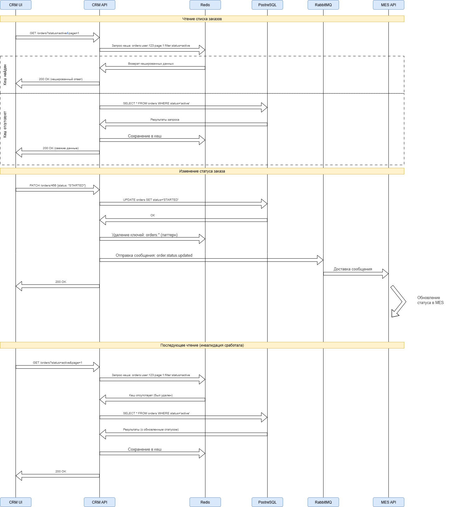

# Анализ кешируемых компонентов
| Компонент                  | Тип кеширования       | Технология      |
|----------------------------|-----------------------|-----------------|
| Расчет стоимости (MES API) | Результаты вычислений | Redis           |
| Каталог товаров (Shop API) | Данные каталога       | Redis           |
| Статусы заказов (CRM API)  | Чтение статусов       | Redis           |
| 3D-модели (S3)             | Статические файлы     | CDN + S3 cache  |
| Список заказов (CRM)       | Pagination cache      | Redis           |
| Пользовательские сессии    | Session storage       | Redis           |
| Готовые изделия (каталог)  | HTML фрагменты        | Varnish / Nginx |

# Мотивация
| Компонент                  | Причины внедрения                                                                                                                | Ожидаемый эффект                                                              |
|----------------------------|----------------------------------------------------------------------------------------------------------------------------------|-------------------------------------------------------------------------------|
| Расчет стоимости (MES API) | Расчет стоимости занимает 2-30 минут, зависит от сложности модели. Повторные запросы с одинаковыми параметрами можно кешировать. | Сокращение времени ответа с минут до миллисекунд. Уменьшение нагрузки на MES. |
| Каталог товаров (Shop API) | Данные об изделиях меняются редко (1-2 раза в день), много повторных запросов.                                                   | Уменьшение нагрузки на БД, ускорение отклика каталога.                        |
| Статусы заказов (CRM API)  | Частые запросы на проверку статусов, данные обновляются нечасто.                                                                 | Ускорение интерфейса CRM, снижение нагрузки на БД.                            |
| 3D-модели (S3)             | Загружаемые пользователями 3D-файлы читаются многократно при расчетах.                                                           | Снижение затрат на S3, ускорение доступа к файлам.                            |
| Список заказов (CRM)       | Частые запросы списков заказов с пагинацией и фильтрами.                                                                         | Ускорение отклика интерфейса CRM.                                             |
| Пользовательские сессии    | Хранение сессий пользователей и корзин покупок.                                                                                  | Ускорение аутентификации, отказоустойчивость.                                 |
| Готовые изделия (каталог)  | Страницы каталога с готовыми изделиями, редко меняются.                                                                          | Снижение нагрузки на бэкенд, ускорение отдачи.                                |

# Предлагаемое решение
### Стратегия кеширования: **Серверное кеширование**
### Причины, почему серверное, а не клиентское:
* **Контроль над данными** - возможность инвалидации и управления кешем
* **Сложность бизнес-логики** - расчеты стоимости требуют единого источника истины
* **Защита данных** - чувствительная бизнес-логика не должна раскрываться клиентам
* **Эффективность** - один серверный кеш вместо множества клиентских

## Паттерны кеширования для различных компонентов
1) Расчет стоимости (MES API)
* Паттерн: **Cache-Aside (Lazy Loading)**
* Почему:
  * Расчеты дорогие (2-30 минут) - кеширование значительно экономит ресурсы
  * Данные read-intensive - много запросов на расчет одинаковых моделей
  * Простота реализации - минимальные изменения в коде
  * Устойчивость к сбоям - при падении кеша система продолжает работать
* Почему не другие паттерны:
  * Write-Through: Избыточен - расчеты инициируются только по запросу
  * Refresh-Ahead: Сложно предсказать - непонятно, когда пересчитывать
2. Каталог товаров (Shop API)
* Паттерн: **Write-Through**
* Почему:
  * Данные изменяются редко - обновления 1-2 раза в день
  * Консистентность критична - нельзя показывать устаревшие цены
  * Предсказуемая нагрузка - известны моменты обновления данных
* Почему не другие паттерны:
  * Cache-Aside: Риск показа устаревших данных при частых запросах
  * Refresh-Ahead: Не нужно - данные обновляются редко
3. Статусы заказов (CRM API)
* Паттерн: **Cache-Aside с TTL**
* Почему:
  * Данные часто обновляются - статусы меняются постоянно
  * Read-heavy нагрузка - много запросов на проверку статусов
  * Приемлемая eventual consistency - небольшая задержка в обновлении статусов нормальна
4. 3D-модели (S3 + CDN)
* Паттерн: **Client-Side + CDN**
* Почему:
  * Статические файлы - идеально для CDN
  * Большой размер - эффективнее кешировать на edge
  * Геораспределенность - пользователи по всему миру
5. Список заказов (CRM API)
* Паттерн: **Cache-Aside** с составными ключами и TTL
* Почему:
  * Динамические фильтры - множество комбинаций параметров
  * Частые обновления - новые заказы появляются постоянно
  * Персонализация - у каждого пользователя свой набор заказов
* Почему не другие паттерны:
  * Слишком сложно инвалидировать все возможные комбинации ключей при каждом новом заказе
  * Refresh-Ahead: Непредсказуемый паттерн доступа к разным фильтрам
6. Пользовательские сессии
* Паттерн: **Write-Through** с сессионным хранилищем
* Почему:
  * Критическая консистентность - сессии должны быть всегда актуальны
  * Простая модель записи - только при login/logout/refresh
  * Высокая доступность - необходимо для работы системы
* Почему не другие паттерны:
  * Риск потери сессий при сбое кеша неприемлем
  * Refresh-Ahead: Избыточно - сессии обновляются предсказуемо
7. Готовые изделия (каталог)
* Паттерн: **Write-Through + CDN** для статики
* Почему:
  * Статический контент - идеально для CDN (изображения, CSS, JS)
  * Динамические данные - актуальные цены и наличие через Redis
  * Высокая производительность - статика отдается с edge-серверов

[диаграмма последовательности действий:](caching_sequence_diagram.drawio)

# Предлагаемое решение

| Стратегия                  | Преимущества                                                                                     | Недостатки                                                               |
|----------------------------|--------------------------------------------------------------------------------------------------|--------------------------------------------------------------------------|
| Временная (TTL)            | Простота реализации, автоматическая очистка	Возможность показа устаревших данных, неактуальность | Подходит для данных, где допустима eventual consistency (списки заказов) |
| По ключу (прямое удаление) | Точечная инвалидация, актуальность данных                                                        | Сложность управления, необходимость знать все ключи                      |
| Паттерн-инвалидация        | Массовая очистка по шаблону, удобство                                                            | Риск удаления лишних данных, нагрузка на Redis                           |
| Write-Through              | Гарантированная консистентность, простота логики                                                 | Высокий latency записи, избыточность для некоторых сценариев             |
| Refresh-Ahead              | Прогнозируемая производительность, свежесть данных                                               | Сложность реализации, риск бесполезного обновления                       |

